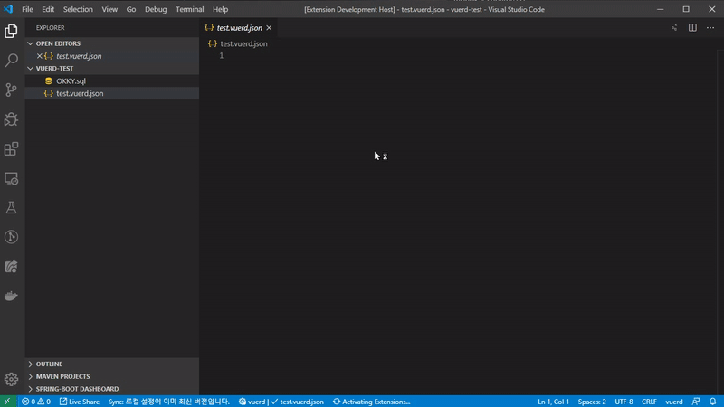
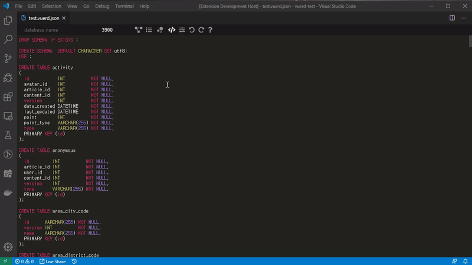
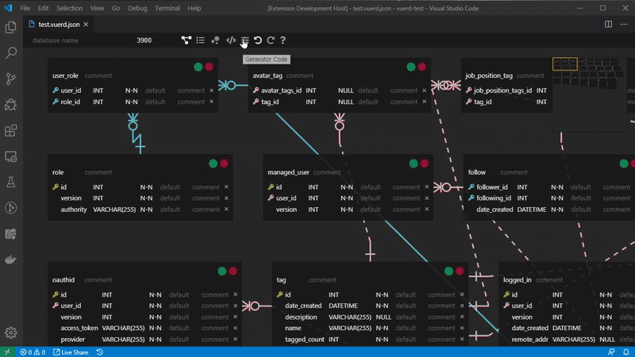
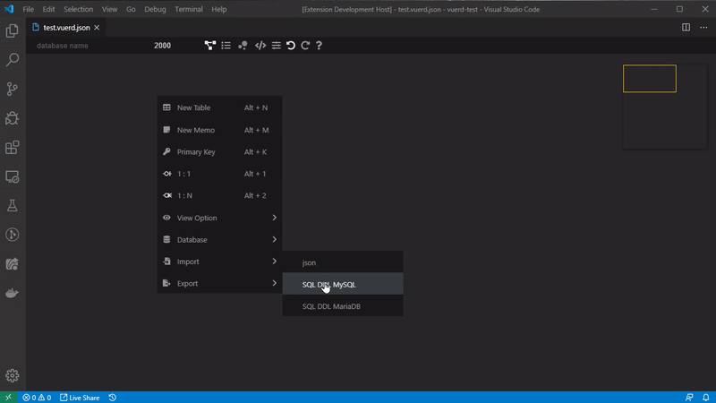

# vuerd-vscode

> [vuerd](https://github.com/vuerd/vuerd) ERD Editor vscode extension

  

## ERD

## SQL DDL

## Generator Code

## Visualization

## SQL DDL Import

## Usage

1. ERD data [filename].vuerd.json Save a file as a form
1. Focus on the saved file and click the vuerd icon in the upper right corner of the Editor window  
     
   

## Document

- [Live Demo](https://vuerd.github.io/vuerd/)

## Editor Action

| Name                            | Action                                                   |
| ------------------------------- | -------------------------------------------------------- |
| Multiple selection(table, memo) | Ctrl + Drag, Ctrl + Click, Ctrl + A                      |
| Multi-movement(table, memo)     | Ctrl + Drag                                              |
| Column shift                    | Drag                                                     |
| Multiple selection(column)      | Ctrl + Click, Shift + Click, Shift + Arrow key(up, down) |
| Copy&Paste(column)              | Ctrl + C, Ctrl + V                                       |
| Contextmenu                     | Right-click                                              |
| New Table                       | Alt + N                                                  |
| New Memo                        | Alt + M                                                  |
| New Column                      | Alt + Enter                                              |
| Delete(table, memo)             | Ctrl + Delete                                            |
| Delete(column)                  | Alt + Delete                                             |
| Select DataType Hint            | Arrow key(right), Click                                  |
| Move DataType Hint              | Arrow key(up, down)                                      |
| Relationship ZeroOne            | Alt + 1                                                  |
| Relationship ZeroOneN           | Alt + 2                                                  |
| Primary Key                     | Alt + K                                                  |
| Undo                            | Ctrl + Z                                                 |
| Redo                            | Ctrl + Shift + Z                                         |
| Editing                         | Enter, dblclick                                          |
| All Action Stop                 | ESC                                                      |

## License

[MIT](https://github.com/vuerd/vuerd-vscode/blob/master/LICENSE)
